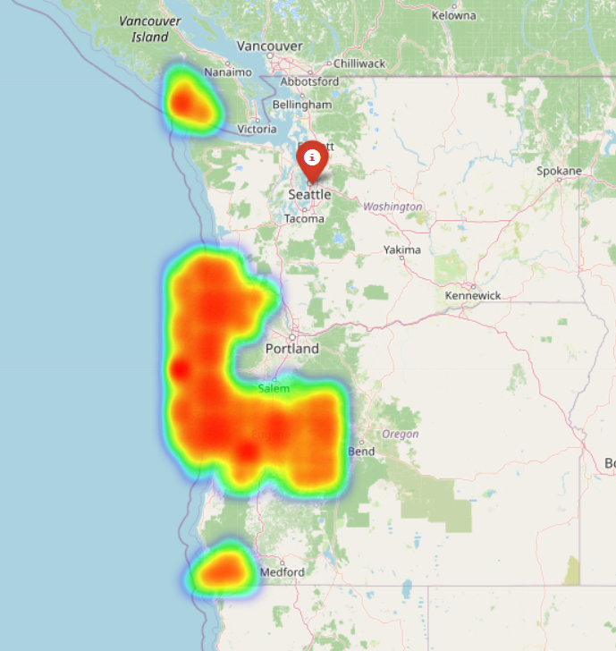

# AquaFormer

**Physics-Informed Extreme Precipitation Forecasting for Flash-Flood Risk Assessment**

AquaFormer is an end-to-end machine learning system for forecasting extreme precipitation over the Pacific Northwest and translating those forecasts into actionable flash-flood risk signals. The project combines probabilistic modeling, spatiotemporal deep learning, large-scale climate data engineering, spatial databases, and low-latency model serving.

It was designed around a central challenge: standard forecasting systems often perform adequately on average weather but struggle on the rare, high-impact rainfall events that matter most for operational risk.

***

## Overview

AquaFormer models extreme precipitation across a **2,500-cell spatial grid** using a two-stage learning pipeline:

1. **Bayesian spatiotemporal modeling (PyMC)** for calibrated probabilistic rainfall estimation.
2. **Physics-informed Vision Transformer (PyTorch)** for high-resolution spatial rainfall forecasting.

The system is built on **34.3 million ERA5 climate records**, served through a **Dockerized FastAPI + Redis microservice**, and evaluated using calibration, rare-event accuracy, physical plausibility, and cost-sensitive risk metrics.

### Selected Results



- Achieved **ECE = 0.038** with a Bayesian spatiotemporal model.
- Achieved **0.63 R²** on **99th percentile rainfall events** with a **2.2M-parameter physics-informed Vision Transformer**.
- Improved substantially over a baseline **XGBoost recall of 28%** on extreme events.
- Reduced **physically impossible predictions to zero** through constraint-aware training.
- Delivered **14ms cached / 110ms uncached** API latency with Redis-backed inference caching.
- Maintained **97% test coverage across 57 integration tests**.

***

## Problem Statement

Extreme precipitation forecasting is difficult for three reasons:

- **Class imbalance:** the most dangerous events are rare.
- **Spatial dependence:** rainfall at one location depends on surrounding atmospheric structure.
- **Operational asymmetry:** missing a severe event is far more costly than issuing a false alarm.

AquaFormer was built to address all three by combining uncertainty-aware modeling, spatial pattern learning, and decision-aware evaluation.

***

## Data

### Source

The project uses **ERA5 climate reanalysis data** from the European Centre for Medium-Range Weather Forecasts (ECMWF).

### Spatial Domain

The study region covers the **Pacific Northwest**, with a focus on areas where oceanic moisture, elevation, and atmospheric river events create strong extreme-precipitation dynamics.

### Input Variables

For each grid cell and hour, the pipeline uses:

- Temperature
- Surface pressure
- U-wind component
- V-wind component
- Specific humidity / derived moisture proxy
- Elevation
- Precipitation

### Scale

- **34.3M** raw spatiotemporal records
- **3 years** of hourly climate data
- **2,500** spatial grid cells
- **24-hour** lookback window for sequence modeling

***

## System Architecture

AquaFormer is structured as a full ML system rather than a standalone model.

### 1. Data Engineering Layer

Raw ERA5 climate tensors are ingested from NetCDF files and transformed into model-ready spatiotemporal records using:

- **Xarray** for multidimensional climate data handling
- **Dask** for scalable processing
- **Python** for feature engineering and orchestration

The processed data is stored in **PostgreSQL/PostGIS**, where spatial indexing enables fast retrieval of location-specific rolling windows for training and inference.

### 2. Probabilistic Modeling Layer

A **PyMC Bayesian spatiotemporal model** is used to estimate calibrated rainfall behavior and uncertainty. This stage provides a probabilistic baseline and improves interpretability by modeling hidden atmospheric structure rather than only deterministic outcomes.

### 3. Deep Learning Layer

A **physics-informed Vision Transformer** forecasts the next spatial rainfall field from the previous 24 hours of weather across the full region. The model treats the weather grid as an image-like structure, allowing it to learn long-range spatial relationships such as moisture transport, terrain influence, and storm propagation.

### 4. Risk Translation Layer

Predicted rainfall fields are translated into operational outputs through:

- Cost-sensitive evaluation
- Rare-event prioritization
- Dynamic risk maps
- Low-latency API serving

***

## Modeling Approach

### Baseline: XGBoost

Development began with an XGBoost baseline to validate that the dataset contained meaningful predictive signal. While useful as a benchmark, the model performed poorly on extreme-event recall, confirming that a more expressive spatial model was required.

### Bayesian Spatiotemporal Model

The Bayesian stage was introduced to model uncertainty explicitly and evaluate whether predicted probabilities aligned with reality.

#### Why it was used

- To quantify predictive uncertainty
- To produce calibrated rainfall probabilities
- To provide a robust probabilistic baseline before deep learning

#### Result

- **ECE = 0.038**, indicating strong calibration

### Physics-Informed Vision Transformer

The final forecasting model is a **2.2M-parameter Spatiotemporal Vision Transformer** built in PyTorch.

#### Input

The model receives the previous **24 hours** of weather across the full spatial grid.

#### Spatial Representation

- Original learning grid: **50 × 50**
- Patch size: **5 × 5**
- Total spatial tokens: **100**

This patch-based design allows the transformer to reason over local and long-range weather structure rather than treating grid cells independently.

#### Output

The model predicts a **2,500-value rainfall field**, with one forecast value per grid cell for the next forecast step.

***

## Physics-Informed Design

AquaFormer was designed to enforce physical plausibility during training and inference.

### Non-Negative Rainfall Constraint

The model uses a **Softplus** output activation to ensure predicted rainfall remains non-negative.

### Moisture-Based Penalty

A custom loss penalizes predictions that exceed a moisture-derived physical bound:

```text
Loss = MSE + β · ReLU(predicted_rain − water_proxy)
```

This helps prevent the model from producing unrealistic rainfall magnitudes.

### Rare-Event Emphasis

Because standard MSE encourages models to predict average conditions, the training pipeline uses **extreme-event weighting** so that severe rainfall is treated as significantly more important than dry or low-intensity conditions.

### Result

- **0 physically impossible predictions**

***

## Evaluation Framework

AquaFormer was evaluated using a mix of statistical and operational metrics.

### Core Metrics

- **ECE** for probability calibration
- **R²** for rainfall fit
- **Rare-event R²** for 99th percentile precipitation
- **Violation rate** for physical plausibility
- **Cost-aware error** for operational risk sensitivity

### Why rare-event metrics matter

A system optimized only for average rainfall would still fail in the cases that matter most. For this reason, evaluation focused explicitly on the **99th percentile** of rainfall events.

### Key Results

- **ECE = 0.038** on the Bayesian model
- **0.63 R²** on **99th percentile rainfall events** with the ViT
- Strong improvement over **28% recall** from the XGBoost baseline
- **0 impossible predictions** after physics-informed constraints

***

## Data Infrastructure

The project required a robust spatial data layer to support both experimentation and deployment.

### Database Design

A **PostgreSQL/PostGIS** schema was used to store climate readings and spatial grid metadata. Composite indexing enabled **sub-second spatiotemporal queries**, which was critical for building rolling 24-hour training windows efficiently.

### Why it mattered

This project was not only about model quality; it also depended on reliable and performant data access across millions of records.

***

## Deployment

The final system was deployed as a **Dockerized FastAPI service** with **Redis caching**.

### Serving Stack

- **FastAPI** for model inference endpoints
- **Redis** for low-latency caching of repeated queries
- **Docker** for reproducible deployment

### Latency

- **~110ms uncached inference**
- **~14ms cached response time**

Caching is especially valuable for spatial forecasting systems, where repeated requests for the same location and timestamp are common.

***

## Risk Mapping and Decision Support

AquaFormer is intended not only to predict rainfall but to support operational interpretation.

Predicted rainfall fields are transformed into **dynamic spatial risk maps** that:

- Highlight severe rainfall zones
- Support early-warning workflows
- Translate raw model outputs into human-readable spatial intelligence

The evaluation framework also weights **false negatives 200x more heavily** than ordinary misses, reflecting the real-world cost of missing a dangerous flood-triggering event.

***

## Testing and Reliability

Reliability was treated as a first-class requirement.

### Coverage and Validation

- **97% test coverage**
- **57 integration tests**

Tests covered:

- API behavior
- schema validation
- database interactions
- physics-loss behavior
- edge-case prediction handling

This was essential because the value of a forecasting system depends not only on model accuracy but also on dependable system behavior.

***

## Tech Stack

### Modeling

- Python
- PyTorch
- PyMC
- NumPyro
- JAX
- scikit-learn

### Data Engineering

- Xarray
- Dask
- NumPy
- Pandas
- NetCDF

### Spatial and Storage

- PostgreSQL
- PostGIS

### Serving and Deployment

- FastAPI
- Redis
- Docker

### Testing and Monitoring

- PyTest
- TensorBoard

***

## Repository Structure

```bash
src/
  models/
    05_vision_transformer.py
    06_physics_loss.py
    08_evaluation_metrics.py
    09_train_real_data.py
    11_cost_optimizer.py
    12_dynamic_risk_map.py
  api/
    main.py
    schemas.py
tests/
  models/
    test_physics_loss.py
data/
  raw/
runs/
```

***

## End-to-End Workflow

1. Ingest ERA5 climate data from NetCDF files.
2. Transform and scale the data with Xarray/Dask.
3. Store spatial records in PostgreSQL/PostGIS.
4. Train an XGBoost baseline.
5. Train a Bayesian spatiotemporal calibration model.
6. Train a physics-informed Vision Transformer on rolling 24-hour weather sequences.
7. Evaluate using calibration, rare-event accuracy, physics constraints, and cost-aware metrics.
8. Serve predictions through a FastAPI + Redis microservice.
9. Visualize severe rainfall patterns using dynamic risk maps.

***

## Practical Relevance

AquaFormer demonstrates how to integrate:

- large-scale data engineering,
- probabilistic modeling,
- spatial deep learning,
- physics-based constraints,
- operational evaluation,
- and production deployment

into a single forecasting system oriented toward real-world risk support.

***

